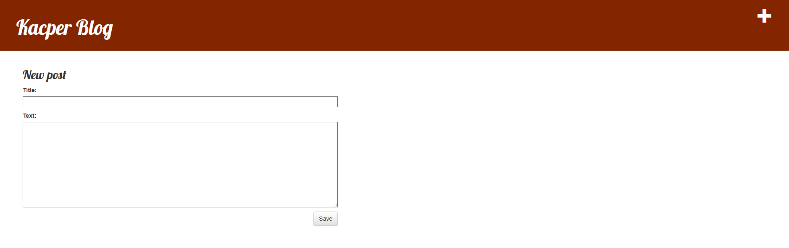
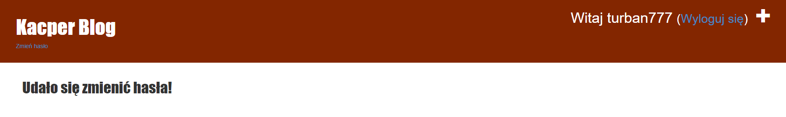

# Aplikacje internetowe - 22672 195IC

<a href="#Lab1">Lab 1</a>

<a href="#Lab2">Lab 2</a>

### Lab nr.1 - Blog

Blog stworzony na podstawie poradnika [Django Girls](https://tutorial.djangogirls.org/pl/)

Link do mojego bloga na [heroku.com](https://heroku.com) - [here :fire:](https://apki-22672.herokuapp.com)

#### Strona startowa

Po wejściu na stronę, można zauważyć tytuł strony, oraz dodane posty. 
W prawym górnym rogu widnieje plus, który przenosi nas do dodania nowego postu.

#### Dodawanie postu

Po wciśnieciu wcześniej wspomnianego plusa, przechodzimy nam do okna w którym możemy stowrzyć nowy post.

#### Detale postu

Po kliknięciu tytułu posta, przechodzi nam do wyświetlenia detali posta. Mamy także opcję kliknięcia edytuj lub usuń post.

#### Edycja postu

Okno edycji postu wygląda tak samo jak okno dodawania posta, tylko przenosi nam już tytuł i zawartość posta.

### Lab nr.2

Stronę musiałem przenieść na Heroku (co zajęło najwięcej czasu), ze względu na problemy z wysyłaniem maili do potwierdzenia konta.
Dodałem do strony możliwość rejestracji konta, logowania i resetu hasła.

Na początek rejestracja konta jak i potwierdzenie na mailu.

Logowanie na konto użytkownika

Reset hasła

