### Lab 4 - REST API, DRF

Post list niezalogowany, informacja o braku autoryzacji

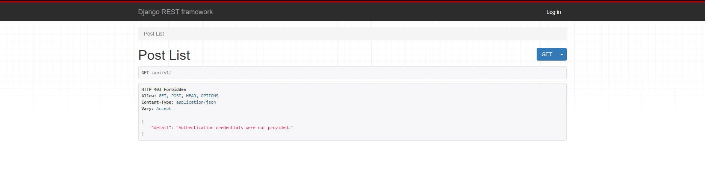

Zalogowany, widoczne posty

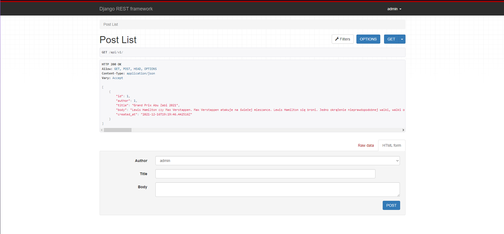

Dodanie postu

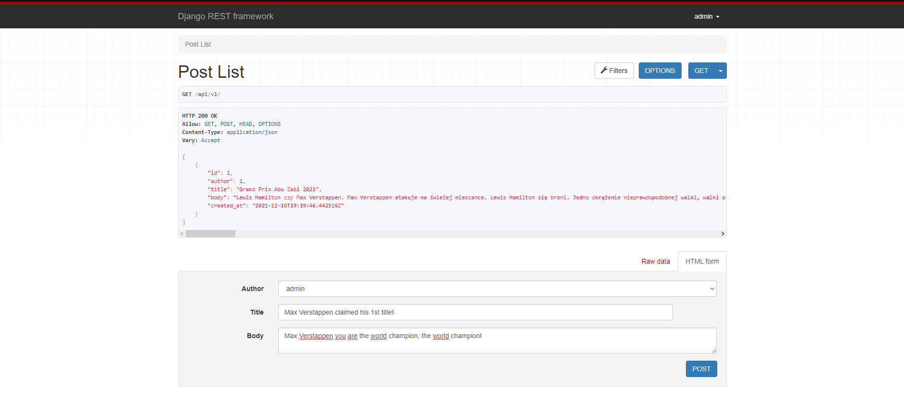

Filtry

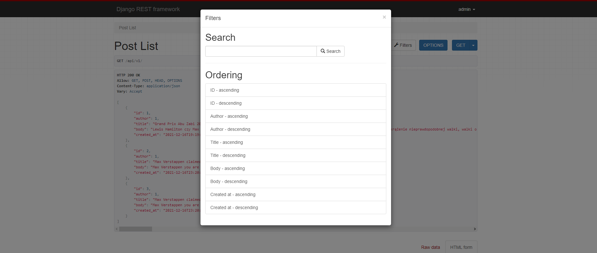

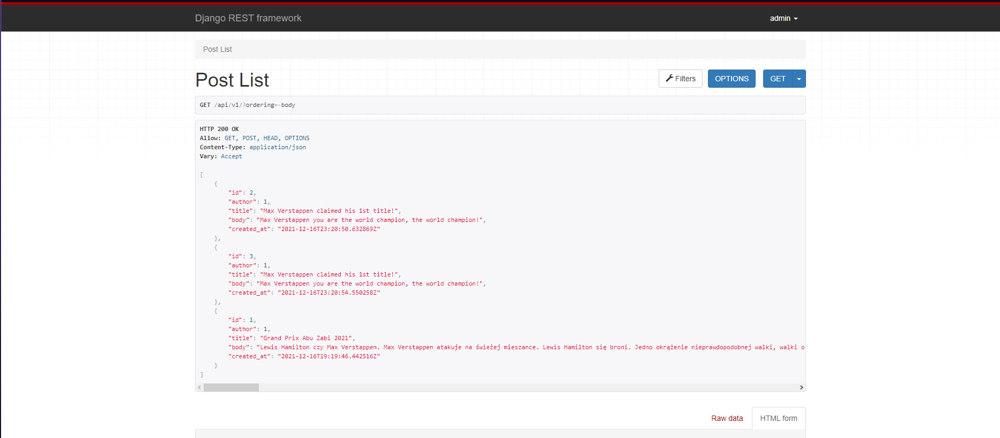

Swagger

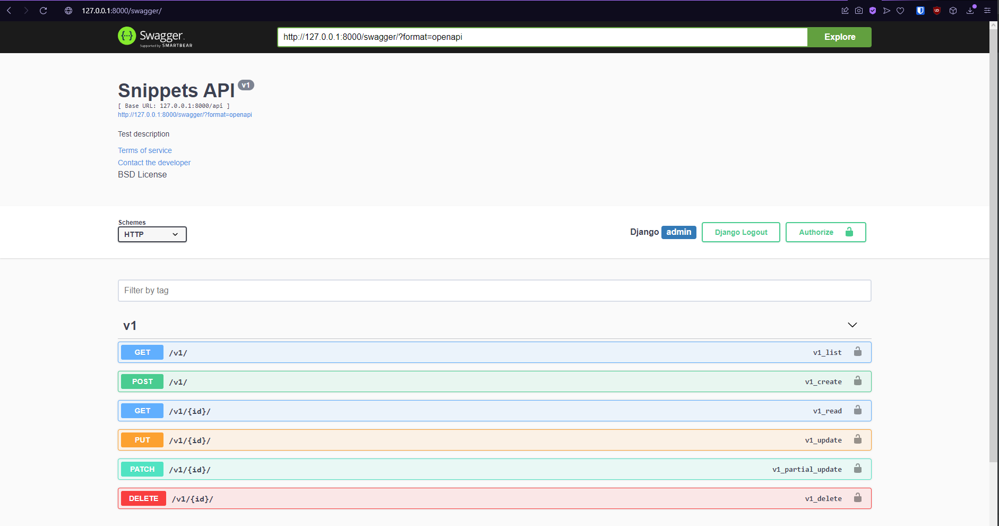

# Lab 6

Login
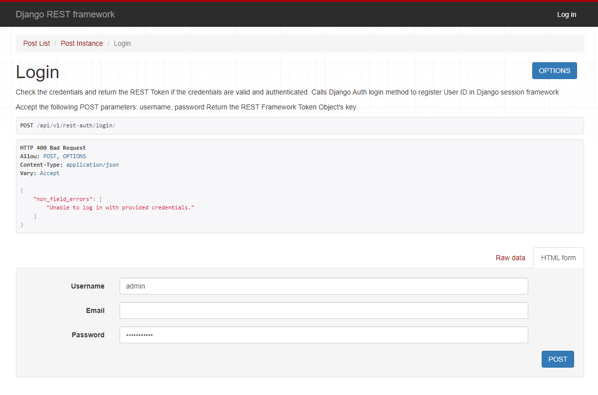
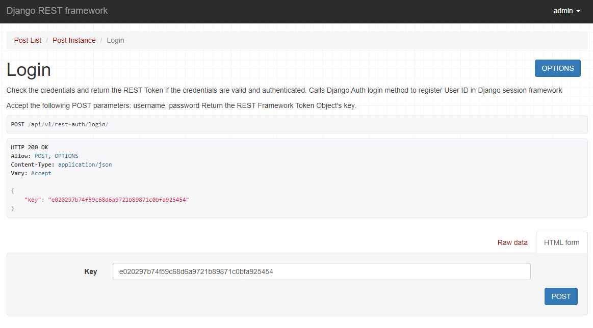

Logout
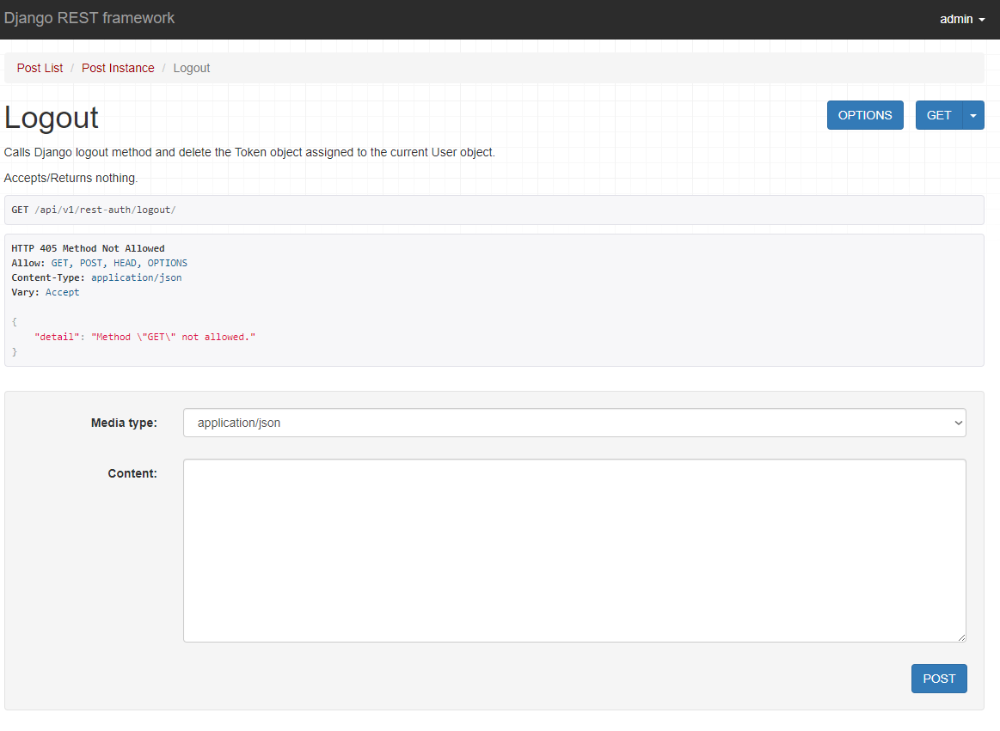
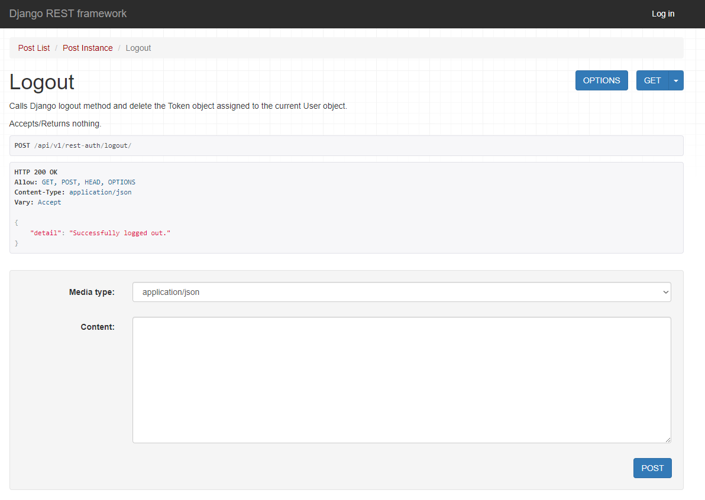

Password reset
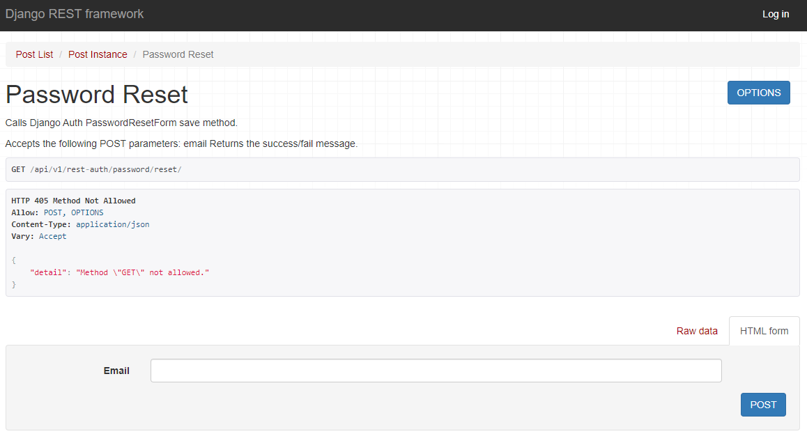
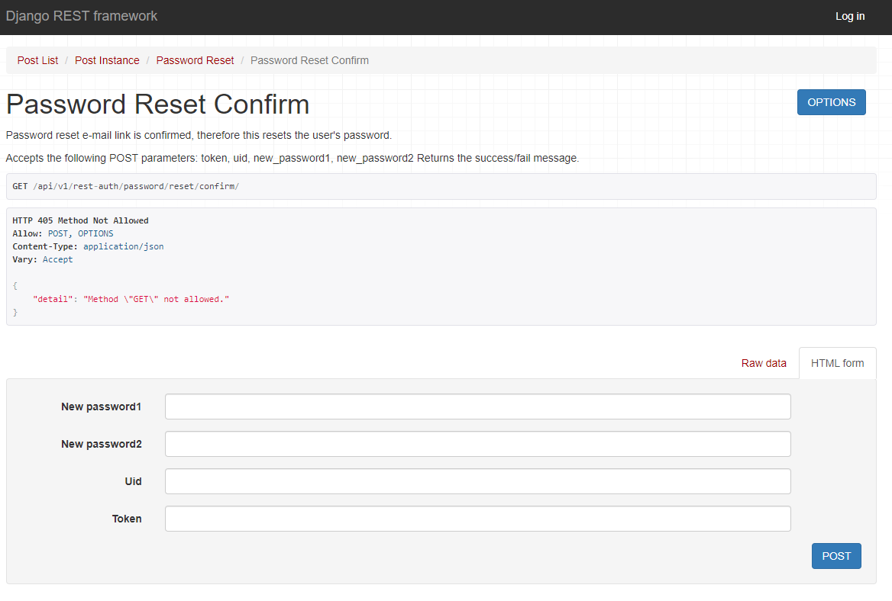

Register
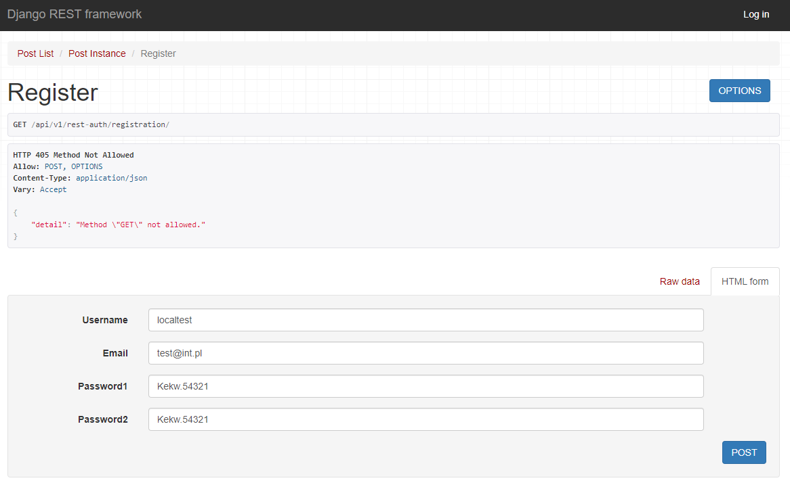
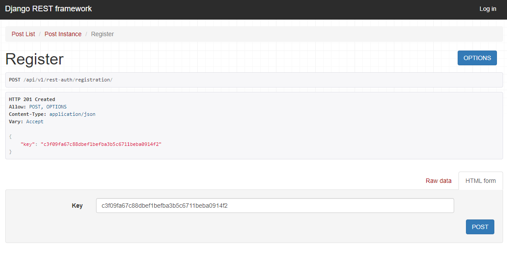

Tokeny w panelu admina
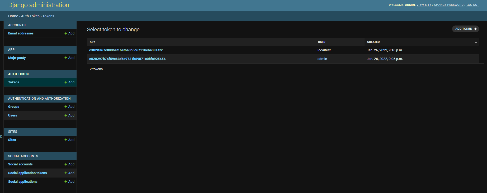

User list
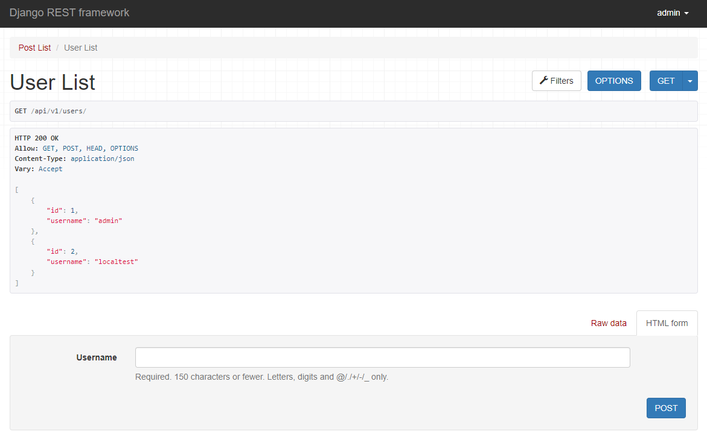

